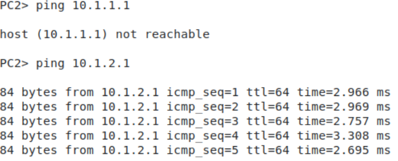
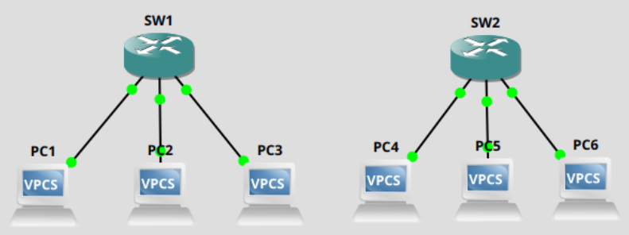
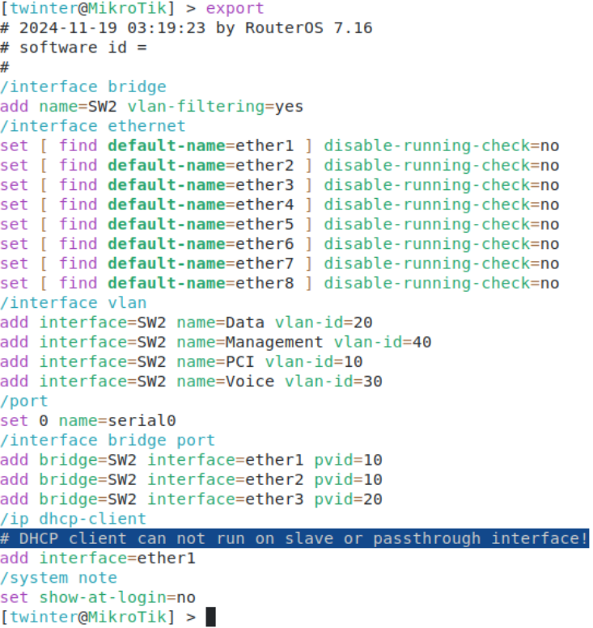
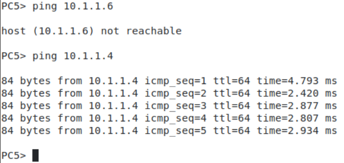

# Basic mikrotik switch set up

First thing I did was add a user for myself and remove the default admin user.

```
user add name <name> password <password> group=full
user remove admin
```

What I would like to do is set up a fairly basic enterprise switch with a few vlans. First, we'll initialize the mikrotik device as a switch and then we'll initialize the vlans and ports with appropriate access vlans assigned. Last we enable vlan filtering.  

```
interface bridge add name=SW1

interface vlan add interface=SW1 name=PCI vlan-id=10
interface vlan add interface=SW1 name=Data vlan-id=20
interface vlan add interface=SW1 name=Voice vlan-id=30
interface vlan add interface=SW1 name=Management vlan-id=40

interface bridge port add bridge=SW1 interface=ether1 pvid=10
interface bridge port add bridge=SW1 interface=ether2 pvid=20
interface bridge port add bridge=SW1 interface=ether3 pvid=20

interface bridge add name=SW1 vlan-filtering=yes
```

Connect a couple of PCs, assign IPs and see if they can ping each other. 


Assigned 10.1.1.1/8 for PC1, 10.1.1.2/8 for PC2 and 10.1.2.3/8 for PC3. Both using 10.1.0.1 as a default gateway, though there isn't one.

Some pings from PC2 showing it can reach PC3 because its in the same vlan, but not PC1 because it is not. 


Expanded my topology a bit.


SW2 config, pretty similar to SW1. PC4 and 5 in vlan10 and PC6 in vlan20.


IPs for PC 4, 5 and 6 are 10.1.1.4, 10.1.1.5 and 10.1.1.6 respectively. Here's PC5 sending pings to PC6 and PC4 to show vlans set up are working as intended.


So now to set up the trunk link between the two switches. 
```
interface bridge port add bridge=SW1 interface=ether8
interface bridge vlan add bridge=SW1 tagged=SW1,ether8 vlan-ids=10
interface bridge vlan add bridge=SW1 tagged=SW1,ether8 vlan-ids=20

interface bridge port add bridge=SW2 interface=ether8
interface bridge vlan add bridge=SW2 tagged=SW2,ether8 vlan-ids=10
interface bridge vlan add bridge=SW2 tagged=SW2,ether8 vlan-ids=20
```

